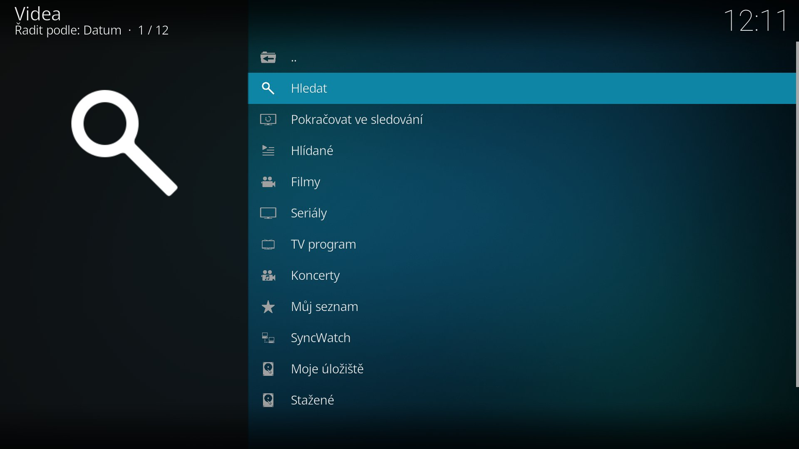
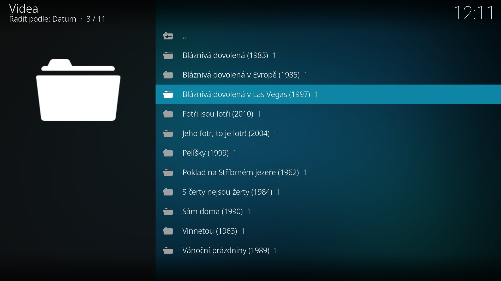
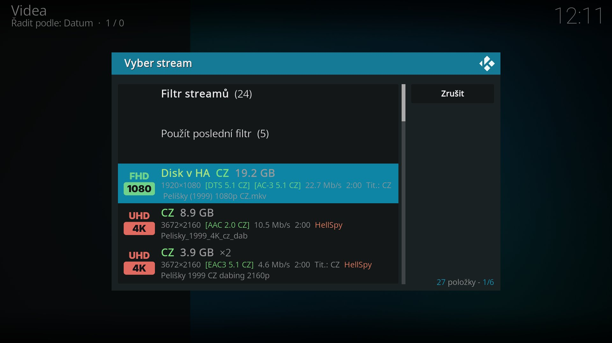
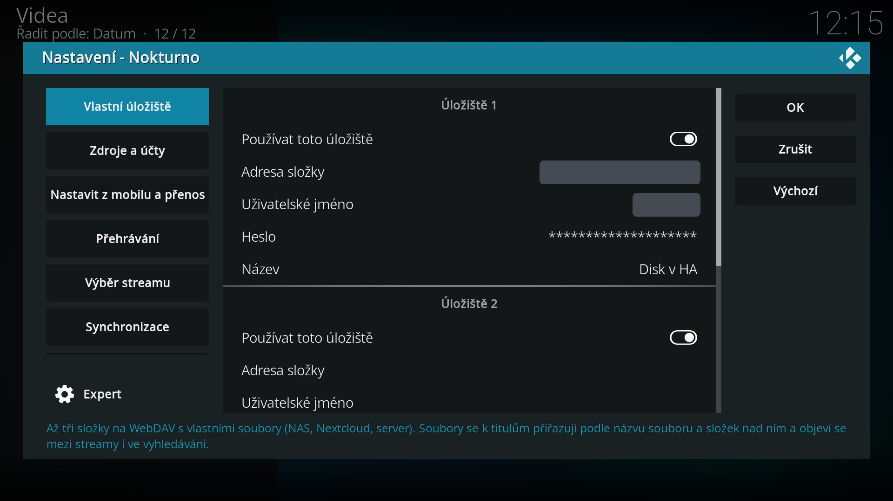

# Nokturno – přehrávač a vyhledávač pro Kodi

Podrobný návod (instalace, nastavení každého zdroje, používání, řešení problémů) je v [návodu pro Kodi](https://nokturno-app.github.io/nokturno-napoveda/navody/kodi/).

Nokturno je přehrávač a vyhledávač pro Kodi a Home Assistant. Přehrává soubory z tvého vlastního úložiště (WebDAV, NAS) i z úložišť a katalogů třetích stran, které si v nastavení zapneš (WebShare, Sosáč, HellSpy, Sledujteto, FastShare / Sdilej.cz, Přehraj.to, CZtor, Luna), titulky hledá na OpenSubtitles. Doplní popisy a pamatuje si, kde jsi skončil. Samo žádný obsah nehostuje ani nešíří a neověřuje, jestli je soubor na cizím úložišti legální. Za to, co přehráváš, odpovídáš ty – používej ho jen k obsahu, ke kterému máš právo.

> **Patří k sobě:** Nokturno je i jako [**integrace pro Home Assistant**](https://github.com/nokturno-app/nokturno-ha) (HACS, přehrává právě přes tenhle doplněk) a jako [**aplikace pro Stremio a Nuvio**](https://github.com/nokturno-app/nokturno-stremio-app), kterou si spustíš u sebe na počítači, NASu nebo Android TV boxu. Všechny stojí na společném jádru.

## Rychlý start

1. V Kodi povol *Nastavení → Systém → Doplňky → **Neznámé zdroje***.
2. Přidej zdroj `https://nokturno.stream/repo/` a z něj nainstaluj `repository.nokturno.zip`, pak doplněk **Nokturno** (přesný postup níž v [Instalaci](#instalace)).
3. Po instalaci tě **průvodce** provede vyplněním zdrojů. Nic víc není nutné – HellSpy a Přehraj.to fungují bez účtu a katalogy bez nastavení.

Nastavení účtů se dá pohodlně vyplnit **z mobilu** (QR kód na TV) nebo přenést z jiného Kodi.

## Zdroje

Video doplněk pro Kodi (20 Nexus a novější, testováno na Kodi 21 Omega, Android TV a CoreELEC). Každý zdroj jde zapnout samostatně, žádný není povinný.

| zdroj | co dává | co potřebuje |
|---|---|---|
| **Vlastní úložiště** (od 3.1.0) | tvoje soubory z NAS, Nextcloudu nebo serveru – až tři WebDAV složky; u titulů mezi streamy vždy první, v menu **Moje úložiště** | adresa složky na WebDAV, případně jméno a heslo |
| **WebShare** (volitelně) | hledání souborů na WebShare a přehrávání, bez dalšího serveru | účet WebShare (jméno + heslo) |
| **Sosáč** (volitelně) | katalogy Sosáče (nejpopulárnější, nově přidané, žánry), filmy i seriály s epizodami | účet **Streamuj.tv** (jméno + heslo) – nic víc; katalogy jsou veřejné, k Sosáči se nepřihlašuje |
| **HellSpy** (volitelně) | fulltextové hledání souborů na hellspy.to a přehrávání původních souborů | nic, rozhraní je veřejné |
| **Sledujteto** (volitelně, od 3.0.0) | fulltextové hledání na sledujteto.cz a přehrávání; rozlišení, kanály a kodek zvuku posílá přímo jejich API | účet Sledujteto (e-mail + heslo), k přehrání **Premium** |
| **FastShare** (volitelně, od 5.1.0) | fulltextové hledání na fastshare.cz a přehrávání; rozlišení a stopáž posílá jejich API, zvuk se dočte z hlavičky souboru (pár set kB z kreditu, jednou za 30 dní) | účet FastShare **nebo Sdilej.cz** (volba *Účet z*, od 8.4.0), přehrání z **kreditu** nebo neomezeného tarifu |
| **Přehraj.to** (volitelně, od 7.0.0) | fulltextové hledání na prehraj.to a přehrávání; funguje i **bez účtu** (první strana výsledků, překódované 1080p), s **Premium** se stránkuje a hraje původní soubor; rozlišení a zvuk se dočtou z hlavičky souboru | nic; volitelně účet Přehraj.to (e-mail + heslo, jiný než na Sledujteto), Premium pro původní soubory |
| **CZtor** (volitelně, od 6.0.0) | předplatný katalog cztor.com; zvuk, titulky a rozlišení rovnou z API | předplatné CZtor, párování PINem (*Nastavení → Zdroje a účty → CZtor → Spárovat PINem*, heslo se nezadává) |
| **Luna: Absolute Cinema** (volitelně) | TMDB katalogy (trendy, populární, podle roku, žánru…), streamy z WebShare s rozpoznanou kvalitou a jazyky | vlastní server [Luna](https://stremio.cz/d/47-luna-absolute-cinema-addon-pro-prehravani-sifrovaneho-obsahu-z-webshare): APK přímo na Android TV boxu (adresa `http://127.0.0.1:7126`), program pro Windows, Linux, macOS nebo NAS, nebo addon Home Assistantu; vždy potřebuje **WebShare VIP** |

Přihlašovací údaje zůstávají v Kodi – doplněk je posílá jen službě, ke které patří (WebShare, Streamuj, Sledujteto, FastShare/Sdilej.cz, Přehraj.to, CZtor, Luna).

## Co umí

- **Vlastní úložiště + osm volitelných vyhledávačů** v jednom hledání a jednom výběru streamu (stejný soubor z více zdrojů se sloučí do jednoho řádku)
- **Výběr streamu v dialogu** – kvalita, jazyk zvuku i titulků, kanály, kodek, velikost; filtr, zapamatovaný stream u seriálu a volba *Skrýt 3D streamy* ([nápověda](https://nokturno-app.github.io/nokturno-napoveda/cs/vyber-streamu))
- **Pokračovat ve sledování**, Můj seznam, rozkoukané a zhlédnuté i bez Kodi knihovny; **Trakt.tv** a **Up Next**
- **Hlídané** (od 8.4.0) – nový díl seriálu nebo titul, který zatím nemá stream, se ohlásí, jakmile se dá pustit; *Kontrolovat dál* hlídá, jestli u titulu nebo dílu nepřibude vhodnější stream (třeba s CZ titulky); sdílí se mezi Kodi i s Home Assistantem ([nápověda](https://nokturno-app.github.io/nokturno-napoveda/cs/hlidane))
- **Vlastní katalogy** (od 8.4.0) – ve Filmech a Seriálech si poskládáš katalog podle žánrů, původního jazyka, let a řazení, bez vlastního klíče TMDB ([nápověda](https://nokturno-app.github.io/nokturno-napoveda/cs/vlastni-katalogy))
- **Vlastní seznam** – až tři soubory JSON na tvých adresách (*Nastavení → Zdroje a účty → Vlastní seznam*); každý je v hlavním menu položka se složkami a videi, která se přehrají přes zdroje a účty doplňku. Za obsah seznamu odpovídáš ty. Tvar souboru a odkazy popisuje [nápověda](https://nokturno-app.github.io/nokturno-napoveda/cs/vlastni-seznam)
- **SyncWatch** (od 8.2.0) – společné sledování až na pěti zařízeních: stejný stream, pauza a přetáčení platí pro všechny
- **Synchronizace více Kodi** (od 6.6.0) – zhlédnuto, Můj seznam, historie, Hlídané, nastavení i přihlášení se sdílí mezi zařízeními **bez Home Assistanta**; server do dat nevidí
- **Katalogy, žebříčky, TV program, Pro Tebe** a náhodný titul; **Stav zdrojů** v menu řekne, co nefunguje
- **Nastavit z mobilu**, **přenos nastavení** do dalšího Kodi a průvodce prvním nastavením
- **Titulky z OpenSubtitles**, **stahování** na pozadí s navazováním, **Přehrát z detailu** přes TMDb Helper (Arctic Fuse)

 
 

<details>
<summary><b>Všechny funkce podrobně</b></summary>

- **Nastavit z mobilu** – na TV se ukáže QR kód a adresa, nastavení vyplníš v pohodlném formuláři v telefonu (včetně hledání a ověření Luny); hesla se nezobrazují
- **Přenos nastavení do dalšího Kodi** (od 6.2.0) – kód `NKT-XXXX-XXXX`, obsah šifrovaný, platí 15 minut; nebo přes soubor na USB. CZtor a Trakt se nepřenášejí
- **Titulky z OpenSubtitles** (od 6.4.0) – doplní české a slovenské titulky, když je zdroje nemají; bez účtu 5 za den, s vlastním 20
- **Pro Tebe** a **Náhodný film / seriál** (od 6.3.0) – doporučení podle historie zhlédnutého (počítá se v tvém Kodi) a losování titulu v oblíbeném žánru s tvým jazykem
- **Stav zdrojů v menu** (od 6.3.1) – řádek nahoře se ukáže, jen když je co řešit (předplatné, Luna, HellSpy, Premium, CZtor, Přehraj.to)
- **Diagnostika Luny** – tlačítka *Najít Lunu v síti* a *Ověřit nastavení Luny*, které řeknou konkrétní příčinu
- **TV program**, **podobné tituly** a **katalogy z dashboardu** (i s podsložkami)
- **Sloučené verze streamů** (`×3`), zvuk a titulky podle preferovaného jazyka (čeština, slovenština, angličtina, maďarština), stahování z kontextového menu s navazováním po přerušení
- **Hlášení o pádech** a zprávy z dashboardu (obojí anonymní, hlášení jde vypnout)
- **Průvodce prvním nastavením** – hned po instalaci požádá o souhlas s podmínkami a nabídne vyplnění zdrojů **z mobilu** (QR kód) nebo krátkého průvodce ovladačem. Pak změří rychlost internetu pro datový tok a – je-li nainstalovaný TMDb Helper – nastaví Nokturno jako jeho přehrávač a přepne ho do jazyka Kodi. Jde přeskočit a kdykoli znovu spustit z *Nastavení → Pokročilé*.
- **Přesná hláška, když zdroj neodpoví** – jmenuje konkrétní zdroj (WebShare, Luna, Sosáč…), ne obecnou chybu. Výsledky ze zbylých fungujících zdrojů se zobrazí normálně.
- **Hledat** napříč zapnutými zdroji – jeden dotaz pro filmy i seriály; volba typu se nabídne, jen když dotaz najde obojí. Stejný titul z více zdrojů jen jednou, zdroj je vidět až ve výběru streamu
- **rok v dotazu je filtr** – „Pět švestek 2026“ vrátí jen film z roku 2026; číslo, které patří k názvu („2012“, „Blade Runner 2049“), se jako rok nebere
- **Hledat na WebShare** – soubory přímo z WebShare API (řazení: relevance / nejnovější / hodnocení / velikost)
- **katalogy** Luny (TMDB) i Sosáče; seriály → série → epizody s plakáty, popisy, hodnocením, obsazením. S vlastním klíčem TMDB mají české popisy i katalogy ze Sosáče
- **streamy z více zdrojů u jednoho titulu** – vlastní úložiště, WebShare, Sosáč, HellSpy, Sledujteto, FastShare, Přehraj.to, CZtor i Luna se prohledají **souběžně** a stejný soubor nalezený víc cestami se ukáže jen jednou; u každého streamu je zdroj, kvalita (u souborů bez kvality v názvu odhad podle velikosti se značkou `~`), datový tok, délka, velikost a jazyky zvuku i titulků – zjištěné ze zdroje, nebo dočtené z hlavičky souboru a označené `~`, když jde jen o odhad. Řazení podle nastavení
- **Vlastní úložiště** (od 3.1.0) – až tři složky s vlastními soubory na WebDAV (NAS, Nextcloud, server). Soubor se k titulu přiřadí podle názvu a složek nad ním (rok u filmu, `S01E02` u dílu), mezi streamy je vždy první se jménem úložiště na začátku řádku; **Moje úložiště** v hlavním menu prochází úložiště po složkách. Nic se do úložiště nezapisuje (žádné `.nfo`/`.strm`). Návod a pojmenování souborů: [návod → Vlastní úložiště](https://nokturno-app.github.io/nokturno-napoveda/navody/kodi/vlastni-uloziste)
- **Hledat volněji podle názvu souboru** – tlačítko dole v seznamu streamů spustí volnější hledání pro případ, že přísný filtr (chrání proti nabídnutí úplně jiného titulu, který hledaná slova jen náhodou obsahuje) zahodil skutečnou shodu; takové výsledky jsou označené jako neověřené
- **Filtr streamů** přímo v seznamu – podle kvality, jazyka zvuku, počtu kanálů (5.1 a víc), kodeku, titulků i zdroje; nabízí jen to, co se v aktuálním seznamu skutečně vyskytuje, s počtem nalezeného v závorce
- **Výběr streamu v dialogu na dva řádky** – klik na titul ve výpisu, Přehrát v detailu, widget i TMDb Helper nabídnou stejný dialog: nahoře kvalita, jazyk a velikost, pod tím rozlišení a kodek, zvukové stopy, datový tok, délka, titulky a zdroj. Nahoře v něm **Filtr streamů**, **Zrušit filtr** a **Použít poslední filtr**. Streamy se načítají jen s ukazatelem v rohu obrazovky. Kvalita je obrázek vlevo, **co a v jakém pořadí se u streamu ukazuje, si nastavíš** v *Nastavení → Výběr streamu* (nebo pohodlně šipkami přes *Nastavit z mobilu*). V kontextovém menu filmu a dílu je **Vybrat stream** a **Stáhnout** (stejný dialog, vybraný stream se stáhne místo přehrání). **Vybrat stream** – dialog i u rozkoukaného titulu, který by jinak hrál rovnou; když přísné hledání nic nenajde, zkusí se uvolněný fulltext sám, jinak je jako poslední řádek dialogu
- **Max. datový tok** místo pevné velikosti v GB – nastavení umí i změřit rychlost internetu a spočítat dovolený tok s 25% rezervou; skutečná velikost se pak dopočítá podle stopáže právě otevřeného titulu, ne podle jednoho čísla pro všechno
- **Pokračovat ve sledování** (rozkoukané + další díl), **Můj seznam**, **Naposledy zhlédnuté**, historie hledání (posledních 10 dotazů), zhlédnuto/rozkoukáno (i bez Kodi knihovny)
- **Zapamatovaný stream u seriálu** – jakmile si u seriálu jednou vybereš stream (zdroj, kvalitu, jazyk), v dialogu dalšího dílu je stejná kombinace předvybraná a Up Next nebo Home Assistant ji pustí rovnou bez ptaní
- **Značka dalšího dílu** – v seznamu epizod je `»` u prvního nezhlédnutého dílu, který navazuje na poslední zhlédnutý
- **Ověřit zdroje** – tlačítko v *Nastavení → Pokročilé* ověří všechny zapnuté zdroje, vlastní úložiště i klíč TMDB a řekne, co nefunguje, bez čekání na prázdný seznam streamů
- **Zkontrolovat aktualizace doplňků** – tlačítko v *Nastavení → Pokročilé* vyžádá kontrolu repozitářů hned, ne až při denní kontrole Kodi
- **Rychlejší procházení** – služba na pozadí drží načtené katalogy pro domovskou obrazovku a předstahuje streamy dalšího dílu rozkoukaných seriálů, takže se otevírají hned
- **Trakt.tv** scrobble (bez vlastní aplikace, stačí přihlášení kódem na trakt.tv/activate, i s free účtem; [nápověda](https://nokturno-app.github.io/nokturno-napoveda/cs/trakt)), IMDb id pro doplňky titulků, cesty pro widgety skinu
- **hodnocení v procentech** – položky nesou vlastnost `RatingPercent` („58 %“) vedle běžného ratingu, takže ji skin může ukázat místo hvězdiček. Hodnocení nese svůj zdroj (IMDb, TMDB, Sosáč), skin tak ukáže správné logo
- **anonymní statistiky** používání, které jdou v nastavení vypnout (viz níže)
- **Synchronizace mezi více Kodi** (od 6.6.0) – zhlédnuto, rozkoukané (i pozice), Můj seznam a historie hledání se sdílí mezi všemi tvými Kodi, **i bez Home Assistanta**. Středisko je dashboard Nokturna, který drží jen zapečetěná data – jsou zašifrovaná klíčem odvozeným z kódu skupiny a server je nepřečte. *Nastavení → Synchronizace*: na prvním Kodi zvol *Založit skupinu / otevřít připojení* a opiš kód `NKT-XXXX-XXXX-XXXX-XXXX`, na dalších *Připojit se ke skupině*. U existující skupiny totéž tlačítko otevře připojení dalších zařízení na 30 minut. Zvlášť se zapíná, co se sdílí: zhlédnuto a rozkoukanost, Můj seznam, historie hledání, Hlídané a (výchozí vypnuté) **nastavení doplňku** a **přihlášení ke zdrojům** – ta jdou zašifrovaná, ale kdo má kód skupiny, přečte je, takže kód patří jen tvým zařízením. **Home Assistant** je dalším členem skupiny: kód zadáš i v nastavení integrace. Kodi v domácí síti může dál synchronizovat přímo s HA přes adresu a klíč (volba *Středisko synchronizace → Home Assistant*). Běží na pozadí, ručně přes „Synchronizovat teď“ v menu
- **Up Next** – je-li nainstalovaná služba [Up Next](https://kodi.tv/addons/omega/service.upnext), dostane u seriálů informaci o dalším dílu a ke konci epizody nabídne jeho přehrání (a s zapamatovaným streamem ho pustí rovnou)
- **Sledování předplatného WebShare** – tlačítko v nastavení ukáže, kolik dní zbývá; upozornění pár dní před koncem a pak každý den, dokud předplatné nevyprší
- **Žánr v popisu titulu** – tučně na začátku, přeložený do češtiny i u titulů z anglicky mluvících zdrojů
- **Nápověda ke každé volbě v nastavení** – dole v dialogu se zobrazí, co položka dělá, ne jen její název

</details>

### Přehrát z detailu filmu (TMDb Helper, Arctic Fuse)

Skiny jako Arctic Fuse ukazují detail filmu nebo dílu přes doplněk TMDb Helper. Jeho
tlačítko **Přehrát** umí spustit Nokturno: *Nastavení doplňku → Pokročilé → Přidat
Nokturno do TMDb Helperu*. Doplněk tam uloží player a nabídne ho jako výchozí –
Přehrát pak podle IMDb id najde streamy v Nokturnu a nabídne dialog s filtrem. Filmy
a díly z výpisů i widgetů Nokturna se z detailu přehrají i bez TMDb Helperu.

## Předpoklady

Katalog a hledání titulů fungují i úplně bez nastavení (vlastní databáze, viz níž). Vlastní úložiště potřebuje jen adresu WebDAV složky. Volitelné vyhledávače chtějí aspoň jeden z tabulky výše – účet WebShare, účet Streamuj.tv pro Sosáč, server Luna, nebo prostě HellSpy a Přehraj.to, které fungují bez účtu.

## Instalace

**Doporučeno – přes repozitář (automatické aktualizace).** Nejdřív je potřeba
povolit Nastavení → Systém → Doplňky → **Neznámé zdroje**.

*Přímo v Kodi, bez prohlížeče (vhodné pro TV a set-top boxy):*

1. Nastavení → Správce souborů → **Přidat zdroj** → jako adresu zadej
   `https://nokturno.stream/repo/` a pojmenuj ji třeba `Nokturno`.
2. Doplňky → **Instalovat ze souboru ZIP** → `Nokturno` → `repository.nokturno`
   → `repository.nokturno.zip`.
3. Doplňky → Instalovat z repozitáře → **Nokturno repozitář** → Video doplňky →
   **Nokturno** → Instalovat.

*Nebo se ZIPem staženým v prohlížeči:* stáhni
**[repository.nokturno.zip](https://github.com/nokturno-app/plugin.video.nokturno/raw/main/repo/repository.nokturno/repository.nokturno.zip)**,
přenes ho do zařízení s Kodi a pokračuj od kroku 2.

Od té doby Kodi nové verze stahuje samo (nebo je nabídne, podle nastavení
aktualizací). Kontrola běží jednou denně; hned si ji vyžádáš místní nabídkou na
**Nokturno repozitář** → *Zkontrolovat aktualizace*.

**Beta verze (novinky dřív, můžou obsahovat chyby):** Doplňky → Instalovat
z repozitáře → **Nokturno repozitář** → Repozitáře doplňků → **Nokturno
repozitář (beta)** → Instalovat. Kodi pak nabízí stabilní verze i bety a vždy
nainstaluje tu nejnovější; po vydání stabilní verze se beta sama nahradí
stabilní. Zpět jen na stabilní verze: beta repozitář odinstaluj a v Informacích
o doplňku vyber poslední stabilní verzi (nebo počkej na další).

**Ručně, bez repozitáře:** stáhni `plugin.video.nokturno-x.y.z.zip` z
[Releases](https://github.com/nokturno-app/plugin.video.nokturno/releases) → Kodi →
Doplňky → Instalovat ze souboru ZIP.

**Návrat na starší verzi:** místní nabídka na doplňku → *Informace* → **Verze**;
repozitář nabízí i předchozí vydání.

## Nastavení zdrojů

Vlastní úložiště nastavíš v kategorii *Vlastní úložiště* (adresa WebDAV složky, každý ze tří slotů jde vypnout přepínačem *Používat toto úložiště*). Volitelné vyhledávače jsou v kategorii *Zdroje a účty*, každý ve vlastní skupině – zapni, co máš: jeden, víc, nebo všech osm:

- **WebShare** – jméno + heslo k WebShare (nebo 40znakový salted hash).
- **Sosáč** – jméno + heslo ke **Streamuj.tv** (přehrávač Sosáče). Katalogy a hledání jdou z veřejných JSON exportů `tv.sosac.to`, streamy ze `streamuj.tv` – stejně jako oficiální Kodi doplněk Sosáče.
- **HellSpy** – jen přepínač v nastavení, rozhraní je veřejné a účet nepotřebuje.
- **Sledujteto** – e-mail a heslo ve skupině *Sledujteto*. Hledá se s jakýmkoli účtem, přehrát jde jen s **Premium**; *Nastavení → Pokročilé → Ověřit zdroje* ukáže, jestli je aktivní.
- **FastShare** – jméno a heslo ve skupině *FastShare*; volbou *Účet z* vybereš, jestli máš účet na FastShare, nebo na Sdilej.cz (od 8.4.0, katalog je stejný, účty ne). Hledá se i bez účtu, přehrání se odečte z **kreditu** podle velikosti souboru (pokud nemáš neomezené stahování); *Nastavení → Pokročilé → Ověřit zdroje* ukáže, kolik kreditu zbývá. Soubor chce cookie z přihlášení, Kodi ji posílá samo. Podrobně v [nápovědě](https://nokturno-app.github.io/nokturno-napoveda/cs/sdilej-cz).
- **Přehraj.to** – zapnuté rovnou po instalaci, účet není potřeba. E-mail a heslo (skupina *Přehraj.to*) přidají další strany výsledků a u **Premium** původní soubor místo překódovaného 1080p. Server omezuje dotazy z jedné adresy (HTTP 429) – doplněk pak zdroj na 10 minut přeskočí; *Nastavení → Pokročilé → Ověřit zdroje* ukáže stav.
- **CZtor** – *Nastavení → Zdroje a účty → CZtor → Spárovat PINem*: na TV se ukáže PIN, zadáš ho na `cztor.com/activate`; heslo se do doplňku nezadává. Podrobně v [nápovědě](https://nokturno-app.github.io/nokturno-napoveda/cs/cztor).
- **Luna** – v nové instalaci vypnutá, zapneš ji přepínačem *Používat Lunu*. Otevři setup stránku Luny (`http://IP-Luny:7126/setup`), zkopíruj **adresu doplňku** (`…/e1.XXXX/manifest.json`) a vlož ji do pole *Adresa doplňku nebo token*; adresa serveru se z ní vezme sama. Tlačítka *Najít Lunu v síti* a *Ověřit nastavení Luny* řeknou, co nefunguje. Luna běží jako APK přímo na Android TV boxu (adresa `http://127.0.0.1:7126`), jako program na počítači nebo NAS, nebo jako addon Home Assistantu, a vždy potřebuje WebShare VIP.
- **Vlastní databáze filmů a seriálů (TMDB)** – nepovinné, ale s klíčem má přednost i před Lunou (viz níž): zdarma klíč z [themoviedb.org](https://www.themoviedb.org/signup) → ikona profilu → *Nastavení* → *API* → *Request an API Key* → *Developer* → krátký formulář → zkopíruj **API Key (v3 auth)** (ne delší "API Read Access Token") do *Nastavení → Zdroje a účty → TMDB API*. Bez klíče se použije Luna (je-li dostupná), jinak zdarma veřejný katalog Sosáče a Cinemeta, ale bez českého popisu. S klíčem mají české popisy i katalogy ze Sosáče.

## Vlastní databáze filmů a seriálů

Katalog (*Filmy* / *Seriály*) a hledání titulů nepotřebují žádný zdroj. Použije se řetězec zdrojů metadat v tomhle pořadí (každý se zkusí, jen když předchozí nic nevrátil):

1. **TMDB** – s vlastním zdarma klíčem (*Nastavení → Zdroje a účty → TMDB API*, v nápovědě je návod) má přednost **i před Lunou** – umí česky i to, co Luna neřekne (popis, obsazení). Luna zůstává zdrojem streamů, ne metadat.
2. **Luna** – bez klíče TMDB, když je dostupná
3. **Veřejný katalog Sosáče** – bez TMDB i Luny, bez účtu, české tituly a žánry, ale bez popisu
4. **Cinemeta** – poslední záchrana, funguje vždy, ale jen anglicky

Streamy samotné (úložiště, WebShare, HellSpy, Sledujteto, FastShare, Přehraj.to, CZtor, Luna) se hledají zvlášť – vlastní databáze řeší jen „co je to za titul“, ne odkud stream stáhnout.

## Nokturno v Home Assistantu

Stejné zdroje umí i [**integrace Nokturno pro Home Assistant**](https://github.com/nokturno-app/nokturno-ha) (instalace přes HACS). Výsledky pouští **v Kodi právě přes tenhle doplněk** (`plugin://plugin.video.nokturno/…`), takže titul skončí v „Pokračovat ve sledování“ a Kodi si pamatuje pozici. Navíc umí stáhnout film do Home Assistantu, poslat odkaz do mobilu, hlídat nové díly a je členem synchronizace s Kodi.

[](https://my.home-assistant.io/redirect/hacs_repository/?owner=nokturno-app&repository=nokturno-ha&category=integration)
[](https://my.home-assistant.io/redirect/config_flow_start/?domain=nokturno)

Tlačítka otevřou tvoji instanci: první přidá integraci do HACS, druhé spustí její nastavení.

Účty se nastavují stejné jako tady; obě aplikace sdílejí knihovny zdrojů, takže se chovají shodně.

## Pro pokročilé a vývojáře

### Struktura

```
addon.xml
default.py                      # router a obrazovky Kodi (nad jádrem: KodiEngine)
service.py                      # služba: zhlédnuto a pozice, Trakt, stahování, hlídání, synchronizace, statistiky
kodi_marks.py kodi_settings.py kodi_sources.py update_info.py   # most mezi Kodi a jádrem
resources/players/nokturno.json # player pro TMDb Helper (Přehrát v detailu filmu → Nokturno)
resources/lib/                  # vysypaná kopie jádra nokturno-core:
  engine.py const.py            #   hledání, streamy ze všech zdrojů, párování, odkazy; klíče nastavení
  webshare_api.py sosac_direct.py sosac_api.py hellspy_api.py sledujteto_api.py
  fastshare_api.py prehrajto_api.py cztor_api.py luna_api.py storage_api.py   #   zdroje a vlastní úložiště
  tmdb_api.py cinemeta_api.py enrich.py wikidata_api.py foryou.py   #   metadata, české a slovenské názvy, Pro Tebe
  streams.py mediainfo.py tracks.py opensubtitles_api.py     #   rozbor a řazení streamů, hlavičky souborů, zvuk a titulky
  store.py watch.py sync.py syncbox.py setsync.py sealbox.py transfer.py syncwatch.py   #   profil, Hlídané, synchronizace, přenos, SyncWatch
  accounts.py source_errors.py badlogin.py deadhost.py abort.py safe_redirect.py   #   stav zdrojů, hlášky, pauzy, přerušení, bezpečné přesměrování
  crash.py stats.py usage.py dash_api.py trend_api.py servers.py   #   hlášení pádů, statistiky, server Nokturna
  trakt_api.py remote_setup.py qr.py   #   Trakt, Nastavit z mobilu
resources/settings.xml
resources/language/…            # cs_CZ, sk_SK, en_GB, hu_HU
repository.nokturno/            # repozitář pro automatické aktualizace (stable)
repository.nokturno.beta/       # repozitář beta (repo/ + repo-beta/)
tools/build_repo.py             # sestaví repo/ (addons.xml, md5, zipy) po změně verze; --beta → repo-beta/
tests/                          # testy bez Kodi (stubs xbmc*), `python3 -m unittest discover -s tests`
```

`resources/lib/` je vysypaná kopie sdíleného jádra Nokturna – opravy patří tam, ne sem.

Test klientů bez Kodi: `python3 resources/lib/luna_api.py http://IP:7126 e1.XXXX`, `python3 resources/lib/sosac_direct.py <streamuj_user> <streamuj_heslo>`

### Anonymní statistiky

Doplněk umí hlásit, jak se používá. Slouží to k jedinému: vědět, kolik lidí ho
má, na čem běží, co funguje a o co je zájem. Sběr je ve výchozím stavu zapnutý
a vypíná se jedním přepínačem v *Nastavení → Statistiky*.

Hlášení nese náhodné id instalace, verzi doplňku a Kodi, platformu, jazyk, zapnuté zdroje (jen přepínače, žádné účty), tituly, u kterých se otevřely streamy, a technické údaje o spolehlivosti (skin, architektura, způsob aktualizace, počty přehrání, doba načítání). Přihlašovací údaje a obsah hledání **nikdy** neodcházejí, IP adresu ani adresy úložišť server ke statistikám neukládá. Po vypnutí (*Nastavení → Statistiky*) se dál jednou za 6 hodin pošle jen náhodné id instalace, verze doplňku a způsob aktualizace, k tomu zpráva, že se doplněk spustil nebo ukončil, aby bylo vidět, že instalace žije.

Data odesílá služba na pozadí, nejvýš jednou za 6 hodin, v jednom malém POST
požadavku na `https://nokturno.stream/collect`. Posílá se kumulativní stav, ne
přírůstky – když se odeslání nepovede, nic se neztratí a nic se nezapočítá
dvakrát. Selhání se nikde neprojeví, doplněk kvůli statistikám nikdy nečeká.
Instalaci, která se dlouho neozvala, server sám počítá jako neaktivní.

### Odeslání logu

V *Nastavení → Pokročilé* je (úplně dole) tlačítko **Odeslat log Kodi**. Po
potvrzení („Opravdu odeslat log?") pošle poslední ~500 KB souboru `kodi.log`
(gzip) na server, aby šel nahlášený problém rozklíčovat – nic dalšího zařízení
neopouští. Funguje i při vypnutých statistikách, protože jde o jednorázovou
diagnostickou akci na vyžádání, ne o průběžný sběr.

Log se posílá na `https://nokturno.stream/logs?id=<id instalace>&version=<verze>`
jako syrová gzip data v těle POST požadavku (stejné `id` jako u statistik).
Očekávaná odpověď je HTTP 200; při chybě (síť, server, moc časté odeslání)
doplněk zobrazí notifikaci s důvodem. Log uvidíme jen my a odpovíme přes zprávy
v doplňku; starší 30 dní se mažou automaticky. Víc v [nápovědě](https://nokturno-app.github.io/nokturno-napoveda/cs/poslat-log).

## Pomoc

- **Dotazy, rady a novinky:** [Discord Nokturna](https://discord.gg/ChmMPmDDEj) (fórum #pomoc, novinky v #novinky). Odpovídáme tam my i ostatní uživatelé.
- **Řešení častých potíží:** [nápověda Nokturna](https://nokturno-app.github.io/nokturno-napoveda/). Podrobné návody k nastavení jsou v [návodu pro Kodi](https://nokturno-app.github.io/nokturno-napoveda/navody/kodi/).
- **Chyba v kódu** (pád nebo chování, které jde zopakovat): [GitHub Issues](https://github.com/nokturno-app/plugin.video.nokturno/issues). Napiš verzi doplňku a Kodi; když jsi odeslal log (*Nastavení → Pokročilé → Odeslat log Kodi*, [jak na to](https://nokturno-app.github.io/nokturno-napoveda/cs/poslat-log)), uveď to taky.

## Právní upozornění

Nokturno je přehrávač a vyhledávač. Soubory leží na serverech služeb třetích stran, nahráli je jejich uživatelé a přehrávač si je stahuje přímo odtud. Nokturno žádný obsah nehostuje ani nešíří a neověřuje právní status souborů, které najde – to, že je soubor ve výsledcích, neznamená, že ho smíš legálně přehrát.

Nokturno smíš používat jen k obsahu, ke kterému máš právo. Přehrávat nebo stahovat autorsky chráněné dílo bez souhlasu nositele práv je zakázáno. Nokturno je zdarma, „tak, jak je“ a bez záruky. Za to, co s ním přehráváš, odpovídáš ty.

Při prvním spuštění se podmínky ukážou k odsouhlasení. Znovu je najdeš v *Nastavení → Podmínky použití* (poslední kategorie). Plný text: <https://nokturno.stream/terms>. Nahlášení porušení práv: <https://nokturno.stream/abuse>.

## Licence

Zdrojový kód je veřejně čitelný pro transparentnost a instalaci přes oficiální
kanály (GitHub Releases, repozitář zipů). Kopírování, úpravy a šíření bez
svolení autora nejsou dovolené – viz [LICENSE](LICENSE).

---
